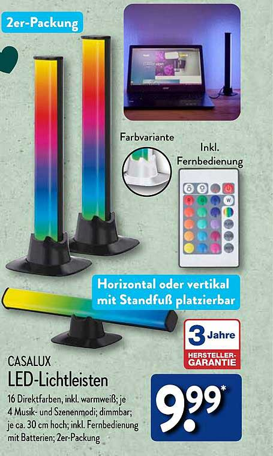
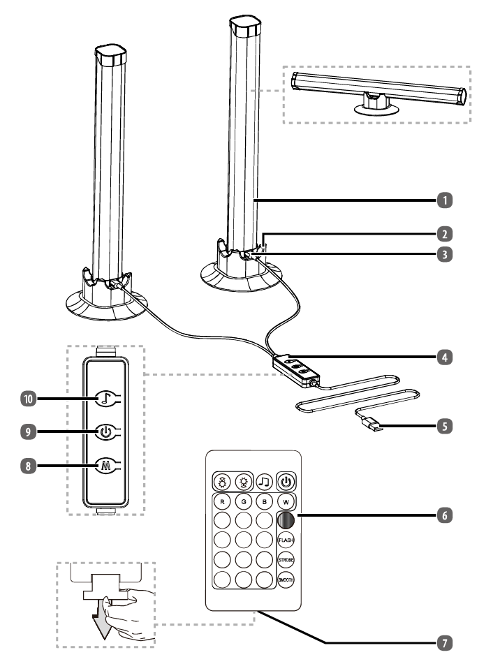
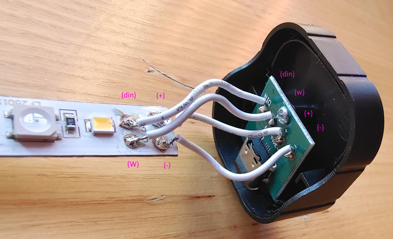
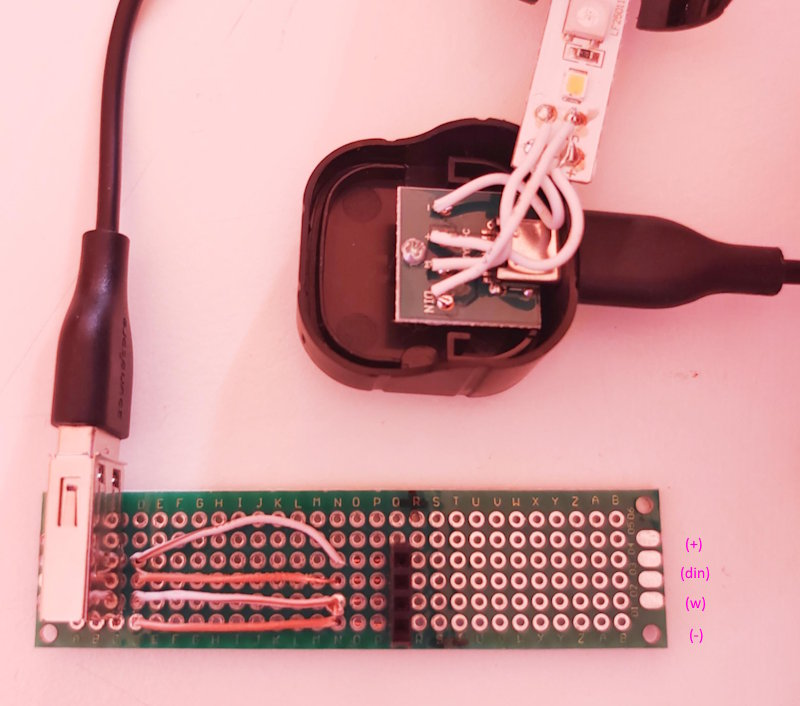

# Lichtleiste

Infos zur "Casalux LED Lichtleiste 2er" (Artikelnummer 851426, verkauft bei Aldi Süd ab dem 15.09.2025).

| Prospekt                      | Teile                   |
|-------------------------------|-------------------------|
|  |  |

* [Produktseite bei Aldi Süd](https://www.aldi-sued.de/de/p.casalux-lichtbalken-er-set.000000000000661212.html)
* [CASALUX Webseite](https://casaluxled.com/)
* [Anleitung](https://as-productmanuals.s3.eu-central-1.amazonaws.com/garantieportal/290593-BG.pdf) ([Kopie](doc/manual.pdf)) im [Aldi Garantieportal](https://www.garantie.aldi-sued.de/) (nach Artikelnummer `851426`suchen)

## USB-C Verbindung

  Die Steuereinheit `4` wird über USB-A `5` mit Spannung versorgt und bietet 2 USB-C Verbindungen `3` zu den beiden Lichtleisten `1`. Die USB-C Verbindungen verwenden eine eigene Verschaltung der USB2 Pins und folgen nicht dem Standard (siehe unten). Die Lichtleiste kann daher ohne zusätzlichen Controller nicht verwendet werden.

Die Enden der Lichtleisten sind verklebt.
Zum Öffnen mit einem Cutter-Messer an den 3 Seiten (welche keinen USB-Stecker haben) einschneiden und mit sanfter Gewalt den "Deckel" lösen.

| USB-C                  | USB-A                        |
|------------------------|------------------------------|
|  |  |

## LEDs

| LED      | Vin (5V) | GND | DIN   |
|----------|----------|-----|-------|
| White    | `+`      | `w` |       |
| RGB LEDs | `+`      | `-` | `din` |

Die Lichtleiste enthält abwechselnd je `14` weiße LEDs **und** `14` RGB LEDs, beginnend mit einer weißen LED an der Seite der USB-Buchse.

Alle **weißen LEDs** sind parallel geschaltet.
Werden an `+` und `w` 5V angelegt, leuchten alle weißen LEDs gleichzeitig.
Es fließen ca. `300 mA`. Für eine PWM Steuerung ist eine Treiberstufe nötig.

Die DIn- und DOut-Pins der WS2812 **RGB LEDs** sind seriell verbunden.
Die Farbreihenfolge des WS2812 RGB LEDs ist: `GRB` (Grün-Rot-Blau).

Ein [ESPHome](https://esphome.io/) Demo Project für die RGB LEDs ist verfügbar in [`led.yaml`](led.yaml).

* Liste der [Effekte der ESPHome Light Komponente](https://esphome.io/components/light/index.html#light-effects)
* Siehe [Docker based ESPHome](https://github.com/ramdacxp/esphome) zur Nutzung ohne [Home Assistant](https://www.home-assistant.io/).
